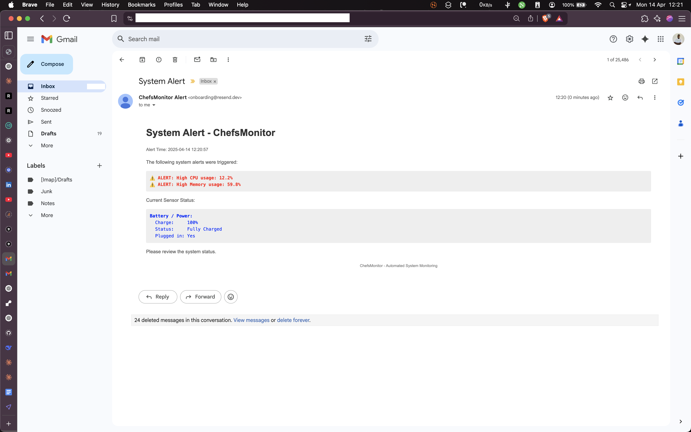

# System Monitoring Lab

## Overview

This lab implements an automated system monitoring solution that tracks system resources and sends email alerts when certain thresholds are exceeded. The solution uses Python with the `psutil` library for system monitoring and Resend for email notifications.

## Features

### Resource Monitoring

The script continuously monitors:

- CPU usage (Alert threshold: 5%)
- Memory usage (Alert threshold: 40%)
- Disk usage (Alert threshold: 70%)

### Sensor Data Collection

Monitors and reports:

- Battery status and power information
- Temperature sensors (if available)
- Fan speeds (if available)

### Automated Email Alerts

- Sends HTML-formatted email alerts when thresholds are exceeded
- Includes detailed sensor information in each alert
- Uses Resend API for reliable email delivery

## Example Alert

Here's what the email alert looks like:



As shown in the screenshot, the alert email includes:

- System resource warnings
- Current battery/power status
- Formatted HTML layout for easy reading
- Timestamp of the alert

## Technical Implementation

- Uses `psutil` for system metrics collection
- Implements environment variables for configuration
- Runs continuous monitoring with 60-second intervals
- Formats data in an HTML template for clear visualization

## Configuration

The script requires the following environment variables:

- `RESEND_API_KEY`: API key for the Resend email service
- `EMAIL_FROM`: Sender email address
- `EMAIL_TO`: Recipient email address

## Usage

To run the monitoring system:

```bash
python monitor.py
```

## Dependencies

- psutil
- resend
- python-dotenv
